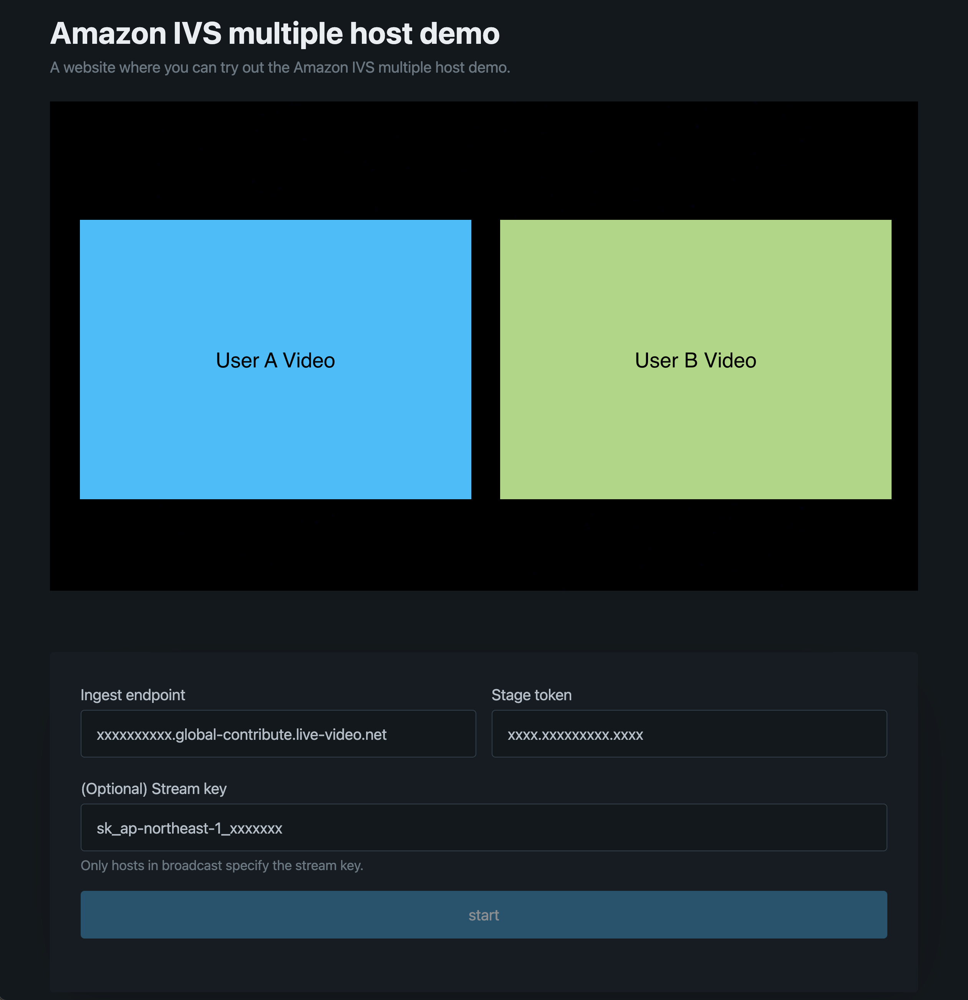
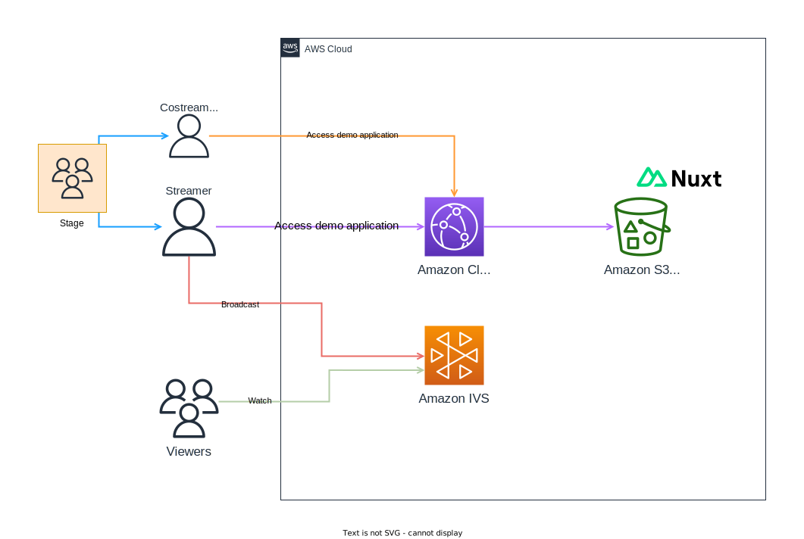
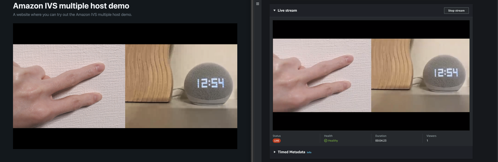

# Amazon IVS multiple hosts web example

This project is a demonstration application to try out Amazon IVS multiple hosts on static website.



## What is Amazon IVS multiple hosts

> Amazon Interactive Video Service (IVS) enables developers to build applications that combine video from multiple participants into one live stream. A stage is a virtual space where participants can exchange audio and video in real time. You can then broadcast a stage to channels to reach a larger audience, and you can build applications where audience members can be brought "on stage" to contribute to the live conversation.

https://docs.aws.amazon.com/ivs/latest/userguide/multiple-hosts.html

## Quick Start

This demo is built on AWS CDK and you can build the following demo environment by running the commands.



To set up a demonstration environment, run the following commands.

```bash
git clone https://github.com/WinterYukky/amazon-ivs-mutiple-hosts-web-example.git
cd amazon-ivs-mutiple-hosts-web-example
npm install
npm run cdk deploy
```

After deploy, you get following values.

| name               | description                 |
| ------------------ | --------------------------- |
| IngestEndpoint     | Channel ingest endpoint.    |
| Participant0Token  | User A's stage token.       |
| Participant0UserId | User A's stage user ID.     |
| Participant1Token  | User B's stage stage token. |
| Participant1UserId | User B's stage user ID.     |
| StreamKeyValue     | Channel stream key.         |
| URL                | Demo application URL.       |

When you got the values, you should access the demo application and enter the channel ingest endpoint and User A's stage token, channel stream key as User A (broadcast host).
Next, please enter the channel ingest endpoint and User B's stage token in another device.

> Note that User B is not a broadcast host and should not enter a stream key.

Please access the IVS service page of AWS Management console. You can watch the multiple hosts broadcast.

  
The images above show a screen of the demo app broadcasting (left) and a screen of the AWS Management Console watching the broadcast (right).

(Left in video: hand with webcam, right in video: Alexa with iPhone 14 Pro).

## Clean Up

Remove it with the following command.

```bash
npm run cdk destroy
```
